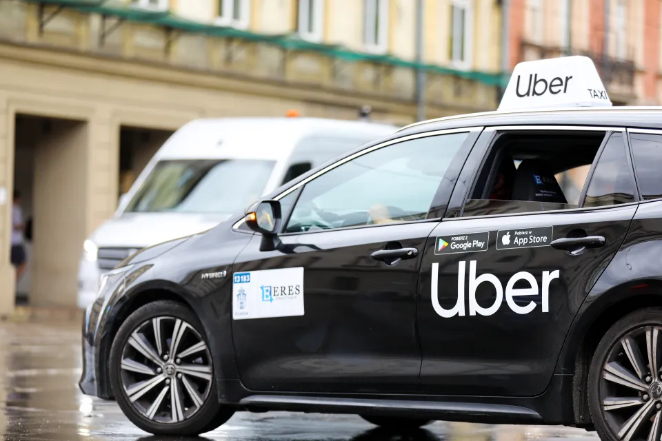

# 🚗 Uber Ride Analytics — 2024

<p align="center">
  
</p>

## 📌 Project Overview

This project performs an exploratory data analysis (EDA) of the **Uber Ride Analytics Dataset 2024**, containing approximately **148K bookings**.

The goal is to analyze Uber's ride operations from different business perspectives, including **demand patterns, cancellations, revenue, routes, incomplete rides, and customer/driver satisfaction**.

The analysis was developed using **Python, Pandas, NumPy, Matplotlib, Seaborn, and Plotly**.

---

## 📂 Dataset

The dataset used in this project is the **Uber Ride Analytics Dataset 2024**, available on Kaggle.

🔗 **Dataset:** [Uber Ride Analytics Dashboard](https://www.kaggle.com/datasets/yashdevladdha/uber-ride-analytics-dashboard)

The dataset contains approximately **148K bookings** with information about ride demand, vehicle types, locations, cancellations, revenue, payment methods, ride distances, and customer/driver ratings.

## 🎯 Objectives

The analysis aims to answer questions such as:

- When is Uber demand the highest?
- How does ride demand vary by day and month?
- Which pickup and drop-off locations are most popular?
- Which routes are used most frequently?
- How does cancellation behavior vary by vehicle type and hour?
- What are the most common reasons for customer cancellations?
- Which vehicle types generate the most revenue?
- Which payment methods contribute the most revenue?
- Which routes generate the highest revenue?
- How much potential revenue is lost from incomplete rides?
- Which vehicle types have the highest breakdown rates?
- Are customer and driver ratings affected by vehicle type or ride distance?

---

## 📊 Analysis Covered

### 1. Demand Analysis
- Bookings by day of the week
- Bookings by month
- Bookings by hour
- Peak and low-demand periods
- Pickup and drop-off location analysis
- Most frequent routes

### 2. Cancellation Analysis
- Cancellation rate by vehicle type
- Cancellation rate by hour
- Dates with the highest number of cancellations
- Customer cancellation reasons

### 3. Revenue Analysis
- Monthly revenue trends
- Revenue by vehicle type
- Average revenue per ride
- Revenue by payment method
- Revenue-generating routes
- Revenue per kilometer
- Relationship between ride distance and booking value

### 4. Incomplete Ride Analysis
- Reasons for incomplete rides
- Potential revenue lost from incomplete rides
- Revenue lost due to vehicle breakdowns
- Breakdown count by vehicle type
- Breakdown rate by vehicle type

### 5. Customer & Driver Satisfaction
- Customer rating distribution
- Driver rating distribution
- Ratings by vehicle type
- Customer ratings across different ride-distance groups

---

## 🔍 Key Findings

### 🚦 Demand

- **7 PM** is the peak booking hour.
- Demand is lowest during the early morning hours, particularly **12 AM–4 AM**.
- Demand varies relatively little across days of the week.
- **July and January** have among the highest monthly demand, while **February** has the lowest, partly influenced by having only 28 days.

### 🚫 Cancellations

- Cancellation rates are relatively consistent across vehicle types, remaining around **24–25%**.
- **Go Sedan** has the highest cancellation rate at approximately **25.29%**.
- **Wrong Address** is the most common customer cancellation reason.
- Evening hours have the highest number of cancellations, largely because overall booking volume is higher during these periods.

### 💰 Revenue

- **March** generated the highest monthly revenue at approximately **4.6M**, while February generated approximately **4.1M**.
- **Auto** generates the highest total revenue at approximately **12.88M**.
- **Go Sedan** has the highest average revenue per ride at approximately **511.50**.
- **UPI** is the largest contributor to revenue, accounting for approximately **44.5%** of total revenue.
- The correlation between **Ride Distance and Booking Value is approximately 0.005**, indicating almost no linear relationship between the two variables.

### ⚠️ Incomplete Rides

- Incomplete rides are almost evenly distributed between **Customer Demand, Vehicle Breakdown, and Other Issues**.
- **Auto** has the highest number of breakdowns because it also has a larger booking volume.
- After accounting for booking volume, **Go Sedan has the highest breakdown rate**, while **Uber XL has the lowest**.
- Vehicle breakdowns represent a significant source of potential lost revenue.

### ⭐ Satisfaction

- Customer ratings are generally high, with most ratings concentrated around **4.2–4.9**.
- **Go Sedan** has the highest average customer rating at approximately **4.41**.
- **Uber XL** has the highest average driver rating at approximately **4.24**.
- Customer ratings remain very consistent across ride-distance groups, suggesting that **ride distance has little impact on customer satisfaction**.

---

## 🛠️ Technologies & Libraries

- Python
- Pandas
- NumPy
- Matplotlib
- Seaborn
- Plotly
- Jupyter Notebook

---

## 📁 Project Structure

```text
Uber-Ride-Analytics/
│
├── Uber_Ride_Analytics.ipynb
├── README.md
└── .gitignore